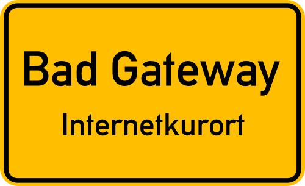

# REST-like

## Versioning

The endpoint paths must start with the version of the API (e.g. `v1/`)

## Endpoint Naming

Endpoints must be descriptive and in the plural form.  
Endpoint names consisting out of multiple word kebab-case.  
methode should bla bla [TODO!]

### Good example:

- [GET] `v1/users/{user-id}`
- [POST] `v1/users`

User information belongs in the request body

### Bad example:

- [GET] /user/getName
- [POST] /users-create?firstName=Max&lastName=Mustermann&Password=1234

## HTTP methods

Allowed methods:

- GET
- PUT
- POST
- DELETE
- PATCH

## HTTP status codes

[HTTP Cats](https://http.cat/)  
[HTTP Status Ducks API - A duck image for every HTTP Status Code](https://httpducks.com/)

## Examples:

Most frequently used codes  
| What happened? | Status Code |
|:----------------------------------------------------|:------------|
| User data was retrieved | 200 |
| A user was created | 201 |
| Job was scheduled | 202 |
| Endpoint excpected a userId but no userId was given | 400 |
| No authorization was provided | 401 |
| No permission for that endpoint | 403 |
| Requested endpoint was not found | 404 |
| Tried to create a user that already exists | 409 |
| 🫖 Teapot | 418 |
| Server ran into error while processing the request | 500 |

## Stateless Endpoints

The application bust be stateless meaning no information is stored about past requests. => same request must return the same response

## Information Transfer

Payloads must be JSON.  
| Param Type | Purpose | Example |
|:----------------|:-----------------------------------------------|:------------------------|
| Path Parameter | Identifying ressource | [GET] v1/users/123 |
| Request Body | Complex, structured data (e.g., JSON payloads) | [POST] v1/users |
| Query Parameter | Filter / sort / paginate | [GET] /users?role=admin |
