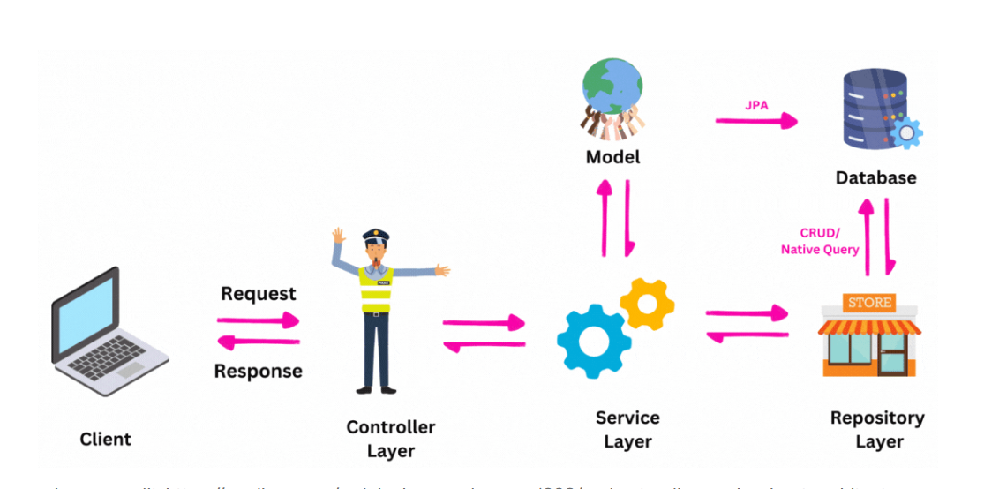

# Spring Boot Architecture
### Everything you need to know about the architecture of a Java Spring Boot application


# Maven/Gradle:

We would recommend to use Maven for this project and the Java Spring Boot Template application we will provide will be
using Maven aswell.

## Lombok:

We recommend you to use Lombok in your project. This will reduce the amount of boilerplate code you have to write by a
ton.

### JDBC and JPA:

Use JPA and JDBC

# If you are already familiar with Java Spring Boot:

### You may only need to have a look at the expected folder structure of the project to understand this page. This folder structure looks as follows:

```
[my-app]/
├─ src/
│  ├─ main/
│  │  ├─ java/
│  │  │  ├─ com/
│  │  │  │  ├─ agilesoftwareengineering/
│  │  │  │  │  ├─ [your-project-name]/
│  │  │  │  │  │  ├─ configs/
│  │  │  │  │  │  ├─ controllers/
│  │  │  │  │  │  ├─ entities/
│  │  │  │  │  │  ├─ dtos/
│  │  │  │  │  │  ├─ repositories/
│  │  │  │  │  │  ├─ services/
│  │  │  │  │  │  ├─ Application.class
│  │  ├─ resources/
│  │  │  ├─ application.yaml
│  ├─ test/
│  │  ├─ java/
│  │  │  ├─ com/
│  │  │  │  ├─ agilesoftwareengineering/
│  │  │  │  │  ├─ [your-project-name]/
├─ .gitignore
├─ pom.xml
├─ README.md
```

## Understanding Java Spring Boot Architecture

Java Spring Boot promotes a structured approach to building applications, drawing inspiration from the
Model-View-Controller (MVC) pattern. It encourages the separation of concerns by organizing code into distinct layers,
primarily:

### 1. Controllers

Controllers are the entry points for external requests into your application. They are responsible for handling incoming
HTTP requests, mapping them to appropriate methods, and returning responses. They act as the "front-desk" of your
application.   
**Example:**
A `UserController` might listen for `GET /users` requests to retrieve a list of users or `POST /users` to create a new
user.

### 2. Services

Services encapsulate the business logic of your application. They act as an intermediary between controllers and the
data layer. Services perform complex operations, coordinate multiple data operations, and enforce business rules. They
keep your controllers lean and focused on request handling.   
**Example:**
A `UserService` would contain methods like `List<User> getAllUsers()`, `User createUser(User user)`, or
`void updateUserDetails(Long userId, User updatedUser)`. These methods might involve fetching data, applying
transformations, or interacting with other services.

### 3. Models (Entities, Repositories, DTOs (Data Transfer Objects))

The "Models" layer in Spring Boot is primarily managed through **Entities** and **Repositories**, forming the backbone
of your data persistence.

- **Entities:** These are plain old Java objects (POJOs) that represent the structure of your data and are typically
  mapped to tables in a database. They define the attributes and relationships of your data.   
  **Example:**
  A `User` entity class would define properties like `id`, `username`, and `email`, often annotated with JPA (Java
  Persistence API) annotations to map to database columns.
- **Repositories:** Repositories provide a standardized way to interact with your data source (e.g., a database). Spring
  Data JPA simplifies this by automatically generating common CRUD (Create, Read, Update, Delete) operations based on
  method signatures. You define interfaces, and Spring provides the implementation.   
  **Example:**
  A `UserRepository` interface would extend `JpaRepository<User, Long>`. You could then define custom query methods like
  `findByUsername(String username)`, which Spring automatically converts into SQL queries.

### 4. Config / Beans

This layer is dedicated to defining application-wide configurations and shared components, often referred to as "Beans."
Spring's Inversion of Control (IoC) container manages the lifecycle and dependencies of these beans.   
**Examples:**

- **Configuration Classes:** Classes annotated with `@Configuration` to define application settings, third-party library
  configurations, or custom bean definitions.
- **Utility Classes:** Common utilities, HTTP clients (like `WebClient`), or message brokers that need to be
  instantiated once and reused across different parts of the application.

## Combining the Layers: The Request Flow

The interaction between these layers follows a clear and logical flow:

1. **Request Arrival:** An incoming HTTP request (e.g., `GET /users`) first hits the **Controller** layer.
2. **Controller Delegation:** The appropriate method in the **Controller** receives the request and, instead of handling
   the business logic directly, delegates the responsibility to the **Service** layer (e.g.,
   `userService.getAllUsers()`).
3. **Service Business Logic:** The **Service** method executes the necessary business logic. This often involves:
    - Fetching data from the **Repository** layer (e.g., `userRepository.findAll()`).
    - Applying transformations, validations, or complex calculations to the data.
    - Potentially interacting with other services or external systems.
4. **Repository Data Access:** The **Repository** interacts with the database to retrieve or persist data, abstracting
   away the low-level database operations.
5. **Response Generation:** Once the Service has completed its task, it returns the processed data back to the *
   *Controller**. The Controller then formats this data into an appropriate HTTP response (e.g., JSON) and sends it back
   to the client.

## Small Spring Boot Example: User Management

Let's illustrate these concepts with a basic Spring Boot application for managing users.   
**1. Model (Entity & Repository)**   
First, define the `User` entity and its `UserRepository`.

```
// src/main/java/com/example/demo/model/User.java
package com.example.demo.model;

import jakarta.persistence.Entity;
import jakarta.persistence.GeneratedValue;
import jakarta.persistence.GenerationType;
import jakarta.persistence.Id;

@Entity
public class User {
    @Id
    @GeneratedValue(strategy = GenerationType.IDENTITY)
    private Long id;
    private String username;
    private String email;

    // Constructors
    public User() {}

    public User(String username, String email) {
        this.username = username;
        this.email = email;
    }

    // Getters and Setters
    public Long getId() {
        return id;
    }

    public void setId(Long id) {
        this.id = id;
    }

    public String getUsername() {
        return username;
    }

    public void setUsername(String username) {
        this.username = username;
    }

    public String getEmail() {
        return email;
    }

    public void setEmail(String email) {
        this.email = email;
    }

    @Override
    public String toString() {
        return "User{" +
               "id=" + id +
               ", username='" + username + '\'' +
               ", email='" + email + '\'' +
               '}';
    }
}

// src/main/java/com/example/demo/repository/UserRepository.java
package com.example.demo.repository;

import com.example.demo.model.User;
import org.springframework.data.jpa.repository.JpaRepository;
import org.springframework.stereotype.Repository;

import java.util.Optional;

@Repository // Indicates that this is a repository component
public interface UserRepository extends JpaRepository<User, Long> {
    // Spring Data JPA automatically provides CRUD methods (save, findById, findAll, deleteById, etc.)
    // You can also define custom query methods here:
    Optional<User> findByUsername(String username);
}

```

**2. Service**   
Now, create a `UserService` to handle the business logic.

```
// src/main/java/com/example/demo/service/UserService.java
package com.example.demo.service;

import com.example.demo.model.User;
import com.example.demo.repository.UserRepository;
import org.springframework.stereotype.Service;

import java.util.List;
import java.util.Optional;

@Service // Indicates that this is a service component
public class UserService {

    private final UserRepository userRepository;

    // Spring automatically injects UserRepository due to @Service and constructor
    public UserService(UserRepository userRepository) {
        this.userRepository = userRepository;
    }

    public List<User> getAllUsers() {
        return userRepository.findAll();
    }

    public Optional<User> getUserById(Long id) {
        return userRepository.findById(id);
    }

    public User createUser(User user) {
        // You could add more business logic here, e.g., validation
        return userRepository.save(user);
    }

    public User updateUser(Long id, User updatedUser) {
        return userRepository.findById(id).map(user -> {
            user.setUsername(updatedUser.getUsername());
            user.setEmail(updatedUser.getEmail());
            return userRepository.save(user);
        }).orElseThrow(() -> new RuntimeException("User not found with id " + id)); // Example error handling
    }

    public void deleteUser(Long id) {
        userRepository.deleteById(id);
    }

    public Optional<User> findUserByUsername(String username) {
        return userRepository.findByUsername(username);
    }
}

```

**3. Controller**   
Finally, create a `UserController` to expose REST endpoints.

```
// src/main/java/com/example/demo/controller/UserController.java
package com.example.demo.controller;

import com.example.demo.model.User;
import com.example.demo.service.UserService;
import org.springframework.http.HttpStatus;
import org.springframework.http.ResponseEntity;
import org.springframework.web.bind.annotation.*;

import java.util.List;

@RestController // Indicates that this is a REST controller
@RequestMapping("/api/users") // Base path for all endpoints in this controller
public class UserController {

    private final UserService userService;

    // Spring automatically injects UserService
    public UserController(UserService userService) {
        this.userService = userService;
    }

    @GetMapping
    public List<User> getAllUsers() {
        return userService.getAllUsers();
    }

    @GetMapping("/{id}")
    public ResponseEntity<User> getUserById(@PathVariable Long id) {
        return userService.getUserById(id)
                .map(ResponseEntity::ok) // If user is found, return 200 OK with user
                .orElse(ResponseEntity.notFound().build()); // If not found, return 404 Not Found
    }

    @PostMapping
    @ResponseStatus(HttpStatus.CREATED) // Return 201 Created status
    public User createUser(@RequestBody User user) {
        return userService.createUser(user);
    }

    @PutMapping("/{id}")
    public ResponseEntity<User> updateUser(@PathVariable Long id, @RequestBody User userDetails) {
        try {
            User updatedUser = userService.updateUser(id, userDetails);
            return ResponseEntity.ok(updatedUser);
        } catch (RuntimeException e) {
            return ResponseEntity.notFound().build(); // Or handle specifically with @ControllerAdvice
        }
    }

    @DeleteMapping("/{id}")
    @ResponseStatus(HttpStatus.NO_CONTENT) // Return 204 No Content status
    public void deleteUser(@PathVariable Long id) {
        userService.deleteUser(id);
    }

    @GetMapping("/username/{username}")
    public ResponseEntity<User> getUserByUsername(@PathVariable String username) {
        return userService.findUserByUsername(username)
                .map(ResponseEntity::ok)
                .orElse(ResponseEntity.notFound().build());
    }
}

```

**4. Configuration (Example for a simple web client)**   
While not strictly part of the core MVC flow, here's an example of a configuration class for a `WebClient` if you needed
to make external HTTP calls.

```
// src/main/java/com/example/demo/config/WebClientConfig.java
package com.example.demo.config;

import org.springframework.context.annotation.Bean;
import org.springframework.context.annotation.Configuration;
import org.springframework.web.reactive.function.client.WebClient;

@Configuration // Indicates that this class provides bean definitions
public class WebClientConfig {

    @Bean // Marks the returned object as a Spring bean
    public WebClient webClient(WebClient.Builder builder) {
        return builder.baseUrl("https://api.example.com") // Example base URL for an external API
                      .build();
    }
}

```

 --- 
This refined documentation and example should provide a solid foundation for understanding the basic usage and
separation of logic in Spring Boot applications! Remember to include necessary dependencies in your `pom.xml` (e.g.,
`spring-boot-starter-web`, `spring-boot-starter-data-jpa`, database driver like `h2` for in-memory testing).   
   
