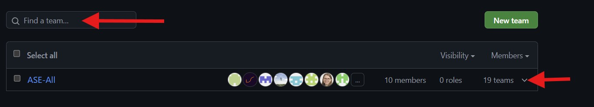

---
sidebar_custom_props:
  myEmoji: 📄️
---

# Getting Access to the Org & Team

For our GitHub-based work, you will first be invited to our GitHub organisation. Once you’ve joined, you can request access to the project team.

## Step 1 – Request an Invitation
> ⚠️ **Important:** The access request form is only available until **21.08.2025**.  
> Please submit your request before this date — late requests cannot be processed.

1. Open the form:  
   [📄 GitHub Access Request Form](https://n8n.pybay.de/form/506dd53a-e175-4d10-9bd4-901b621f4d9a)
2. Enter your **GitHub account email**.  
   💡 *Make sure this is the email linked to your GitHub account!*
3. Submit the form.

## Step 2 – Accept the Invitation
1. Check your email inbox for a message from **GitHub**.
2. Click the **“Join”** button in the invitation email.
3. You are now part of the organisation.

## Step 3 – Join the Project Team
1. Go to our organisation page:  
   [https://github.com/Agile-Software-Engineering-25](https://github.com/Agile-Software-Engineering-25)
2. Navigate to the **“Teams”** section.
3. Locate your **Area**.
4. Find your **Team** by entering your team number in the search box or by expanding the team hierarchy tree.  
   
5. Click **“Request to join”**.

> 💡 If you are a **PO** or **Scrum Master**, please also request to join your dedicated area.

---

✅ Once your request is approved, you’ll have access to the project repositories and resources.
